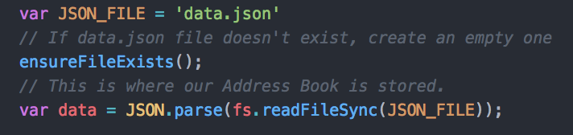
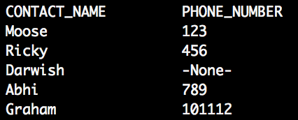
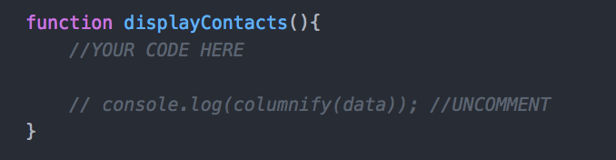
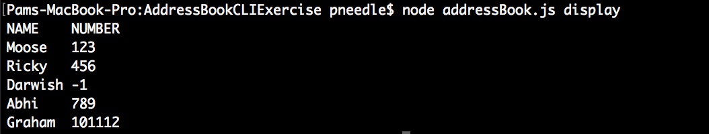
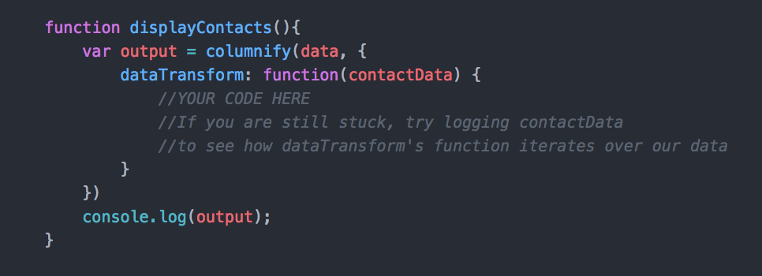

# Pair Programming Exercise: Address Book using Command Line Arguments

## Goal

The goal of this exercise is to build a command line Address Book manager

## Intro to the command line

Many things you can do with a graphical user interface can be done through a text-only interface in the command line. Since NodeJS frees up JavaScript to run outside the browser, you can now create JavaScript applications that run from your terminal!

In this exercise we will build a command line tool in JavaScript and use NodeJS to run it. Similar to other command line tools we have been using (think git or npm), we can change the behavior of our application by passing in arguments or flags (`npm install` compared to `npm install --save`). In the `npm install --save` we call `install` an argument to the npm command and `--save` a flag. Notice how the save flag changes the behavior of the `npm install` command. We will use flags and arguments to specify behavior in our application as well.

### Commands

**Commands** are arguments that specify specific actions. You can run:
`node myProgram.js doSomething`. `doSomething` is not a flag, it is an argument or sub-command for the `node myProgram.js` command line tool. Consider if `myProgram.js` was a calculator application; then `node myProgram.js add` contains the command `add` and `node myProgram.js delete` contains the command `delete`. Commands given to a program are just special arguments that modify the behavior of the app/tool we are running.
### Arguments

**Arguments** We can pass strings or numbers into our program to be used as arguments or parameters.
`node myProgram.js square 4` contains the arguments `square` and `4` but we think of `square` as a command and `4` as the argument or parameter for that specific command.

Flags, commands, and parameters are all specific kind of arguments. A flag is usually setting a Boolean and starts with a `-` , a command usually follows the main program and modifies or specifies the specific behavior (`square` and `add` in the calculator example above), and a parameter is usually what the command is taking in as its input.


## Introduction - The Address Book
Our Address Book data is stored in the file called data.json. The address book is an array objects. Each object represents a Contact and has two properties:
 1. name: a string (letters only!), first name of the contact
 2. number: a number (numbers only!), phone number of contact

 <!-- 3. email: an email, email of contact -->

Our Address Book can be accessed from within addressBook.js using our `data` variable (this is already done for you at the top of the file):




### Running and testing

1. Go to `week03/day1/addressbook-cli` in your terminal and install npm dependencies

   ```bash
   npm install
   ```

2. Run tests to verify your code. As you implement functionality keep running
tests to make sure your code works.

   ```bash
   npm test
   ```

3. Make your changes to `addressBook.js` in Atom.


### Steps
Sections:
1. [Parsing Command Line Arguments](#part-1-parsing-command-line-arguments)
1. [Implementing the 'display' command](#part-2-implementing-the-display-command)
1. [Implementing the 'add' command](#part-3-implementing-the-add-command)
1. [Implementing the 'update' command](#part-4-implementing-the-update-command)
1. [BONUS: Implementing the 'delete' command](#part-5-implementing-the-delete-command)


### Features

Our command line Address Book manager should support the following commands:
- **add**
  - `$ node addressBook.js add John 1234567` - Adds a new Contact item with name `John` and number 1234567
- **display**
  - `$ node addressBook.js display` - Displays all contacts in the address book
- **update**
  - `$ node addressBook.js update John 11111` - Finds contact named John and updates his number to 11111
  - `$ node addressBook.js update John Johnny` - Finds contact named John and updates his name to Johnny
- **BONUS: delete**
    - `$ node addressBook.js delete John` - Finds contact named John and removes him from address book


Let's get started!


## Part 1: Parsing Command Line Arguments

**Commands** are arguments that specify specific actions. You can run:
`node myProgram.js doSomething`. `doSomething` is not a flag, ]it is an argument or sub-command for the `node myProgram.js` command line tool. Consider if `myProgram.js` was a calculator application; then `node myProgram.js add` contains the command `add` and `node myProgram.js delete` contains the command `delete`. Commands given to a program are just special arguments that modify the behavior of the app/tool we are running.

#### Task: Implement parseCommand()
In order to for our application to determine which action/command to perform, you parse the specified command from the command line arguments.
This function should parse the command argument from the command line using `process.argv` and return it.

The command will be the first argument: <br>
`$ node addressBook.js add John 123`    parseCommand() returns 'add' <br>
`$ node addressBook.js display`         parseCommand() returns 'display' <br>
`$ node addressBook.js`                 parseCommand() returns "" <br>


> **Note:** If you need a refresher on what `process.argv` is, see [here](https://www.google.com)


## Part 2: Implementing the 'display' command
Write the function displayContacts(). It will be called in the following way:  
`$ node addressBook.js display` 

### Goal
This function should output the appropriate contacts using console.log() and [columnify npm package](https://www.npmjs.com/package/columnify).  
Contacts that do not have a phone number (for which we put -1 as the placeholder), should be displayed with `'-None-'` in place of their number, as follows:  



### Using columnify
[Columnify](https://www.npmjs.com/package/columnify) is an npm package that formats console output from objects or arrays of objects into organized columns. We will use it to display the contacts in our address book like the image above.

##### Steps
1. `npm install --save columnify`
1. At the top of addressBook.js `var columnify = require('columnify')`
1. Inside displayContacts(), uncomment the line labeled 'UNCOMMENT'<br>
 <br>
 then run `$ node addressBook.js display` to see how columnify works!
    <details>
    <summary>Show Result</summary>
    
    </details>
1. Explore the columnify module to match your output to the 'Goal' shown above.  
**NOTE**: Simply calling columnify on our entire addressBook directly will print out our contacts exactly as they are stored in our data array. There are two key things you need to fix:  
              1. Change the columns so that they read "CONTACT_NAME" and "PHONE_NUMBER"
              <details>
              <summary>Hint</summary>
              [Use columnify's headingTransform option](https://github.com/timoxley/columnify#transforming-column-data-and-headers)
              </details>
              2. For contacts without phone numbers, display '-None-' instead of '-1'
              <details>
              <summary>Hint</summary>
              Checkout [columnify's dataTransform option](https://github.com/timoxley/columnify#transforming-column-data-and-headers)
                  <details>
                  <summary>Super Hint</summary>
                  
                  </details>
              </details>
     


> **Test:** Run your tests!  


## Part 3: Implementing the 'add' command
Write the function addContact(). It will be called in the following ways:  
- With name and number:`$ node addressBook.js add Darwish 123`  
- With name: `$ node addressBook.js add Darwish`


The add command will create a new contact with the specified name and number and save it into our data file.
> **Tip** We already handle writing to the data file for you, so all you need to do is add each new contact to our data array


addContact() is the function that is called to create a new contact. Calling `$ node addressBook.js add contactName contactNumber ` must call our function addContact.
It should get the name and number of the Contact from process.argv.

In order to pass all the tests, you will need to validate what was passed in for the name and number. That means that we only create a new contact if the name consists of only letters and the number, if specified, consists of only numbers.

**Rules**
- Every contact is an object with the following properties:
    1. **name**: REQUIRED a string (letters only!), first name of the contact
    2. **number**: OPTIONAL a number (numbers only!), phone number of contact
- *Important* There can be no duplicate names! When testing, make each name unique
- You should only create a new contact if a name is provided
    - if no number is provided, store -1 as their number instead
- console.log() your success/failure messages:
 - When you add a new contact, console.log() a success message such as:  
`"Added contact Darwish"`
 - If either there was no name provided, the name was invalid, or the number was invalid, do not add any contacts, console.log() a failure message like:  `Invalid contact format`


**Bonus** Use the npm package [validate](https://www.npmjs.com/package/validator) to perform these checks

> **test** Run your tests!

## Part 4: Implementing the 'update' command
The update command is called to update an existing contact. You can update either a contact's name or number by running the following in your terminal:

**Rules**
- If a contact with the specified name does not exist, console.log() `No contact found`
- If contact is successfully updated, console.log() the updated contact like this: `Darwish 123`
- ONLY update the contact if the new name or number is valid! (Just like how you checked for validity in addContacts())

> *TEST* Run your tests!


## BONUS Part 5: Implementing the 'delete' command
### Goal


### Flags

**Flags** are boolean values that are set by being included when calling the program.
`node myProgram.js --cookies` is calling `myProgram.js` with the flag `cookies
= true` and the flag `milk = false` because it is not present.

Flags normally have shortened versions, so `--cookies` is equivalent to `-c`.
`node myProgram.js -c`
